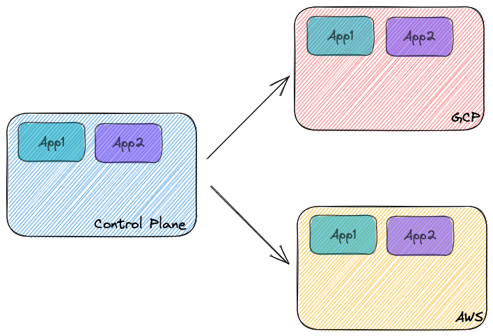
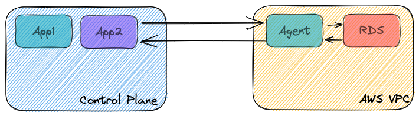

# Korean Restaurants B/E

The B/E for
[Korean Restuarants](https://github.com/chrisjpalmer/korean-restaurants).
Provides the capability to search for the nearest restaurant.

The API for the B/E service can be found [here](./api/spec.yaml)

**UPDATE: Hosted on Control Plane**

This application is deployed to [Control Plane](https://controlplane.com). The
B/E URL is: https://korean-restaurants-be-x1ncq0w8e0jnm.cpln.app/

Try firing a request at the B/E using the swagger spec!

## Getting Started

### Requirements

- Docker
- Port 3001 free on your computer

### Running it

```sh
git clone https://github.com/chrisjpalmer/korean-restaurants-be
cd korean-restaurants-be
```

If you are a Makefile person:

```sh
make database
make build-docker
make serve-docker
```

If you are not a Makefile person:

```sh
./scripts/make-database.sh
./scripts/build-docker.sh
./scripts/serve-docker.sh
```

The server should now be listening on port http://localhost:3001

## Test it works

```sh
curl "http://localhost:3001/restaurant?nearby=126.9775201550173,37.22450239990378&within_meters=1000"
```

## DevSecOps

I believe DecSecOps is an important part of software development. In this
project I implemented a few good practices:

1. Sensitive data stored in github secrets.
2. Trivy image scanning before artifacts are published.
3. Dependabot enabled so if a CVE is detected in a dependency being used, GitHub
   generates a PR with the dependency update.
4. Automated CI/CD process to eliminate human error during deployment.

Ultimately to do DevSecOps properly, security needs to be in the mindset of the
organization and be part of every process in the Software Development Life Cycle
(SDLC). Here are some examples of things you could do in different stages of the
SDLC to implement DevSecOps:

**Requirements / Planning**

- Are access controls implemented at the application level to keep users safe?
- Are there any escalation of privilege scenarios in the application level?
- Avoid misleading users into unsafe usage patterns that an attacker could take
  advantage of + remind them what the correct usage patterns are ("SafeBank will
  never ask for your password over the phone").
- Encourage MFA

**Architectural Design**

- Consider potential DoS attacks on architectural change.
- Consider potential escalation of privilege attacks on architectural change.
- Mitigate "unhappy paths" that lead to an inconsistent state across services.
- If SaaS platform, enforce Tenancy at the database level in every service.
- Is principle of least privilege implemented? - check every commponent, ask
  what privileges it has and why?
- Multiple protections for the same thing (E.g. dont expose insecure APIs in
  routing rules AND only whitelist secure APIs on security policies)
- Use of temporary credentials with credential manager such as Vault.
- Istio: enforce MTLs and default deny all service-to-service communication
  unless explicitly whitelisted via `AuthorizationPolicy`.

**Development**

- Consider impacts of code to be written - could it be exploited?
- Write unit tests designed to break modules / exploit common attack vectors
- Prevent commiting secrets using git commit hooks.
- Static analysis tools
- Codebase scanning
- Build
  [Best Practice](https://docs.docker.com/develop/develop-images/dockerfile_best-practices/)
  Docker Images
- Docker Image scanning

**Testing**

- Write integration tests designed to break services / exploit common attack
  vectors.
- Write integration tests to validate security boundaries are implemented.
- Establish a culture of never exposing insecure APIs for testing even in the
  development environment. Solve using in-cluster integration testing (better
  still trust your Unit tests and dont expose at all).

**Deployment**

- In-cluster artifact scanning
- Chaos testing
- Run integration tests regularly

## About Control Plane

This application was deployed with Control Plane. Control Plane allows you to
deploy containerized workloads to multiple cloud providers without having to
manage the underlying infrastructure. Under the hood Control Plane uses
kubernetes and istio. This allows an operator to define a simple definition of
their workload, and have it deployed across cloud providers. This application is
deployed across AWS and GCP clusters.



This application depends on a postgres database to operate. An RDS instance was
deployed to AWS, and then linked to the Control Plane account using an _Agent_.
_Agents_ allows workloads deployed to Control Plane to consume services in
another VPC or private network.


